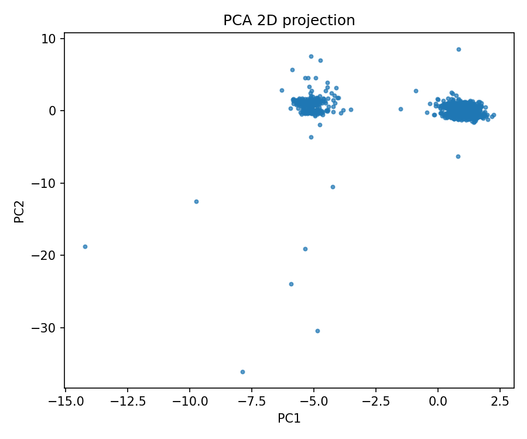
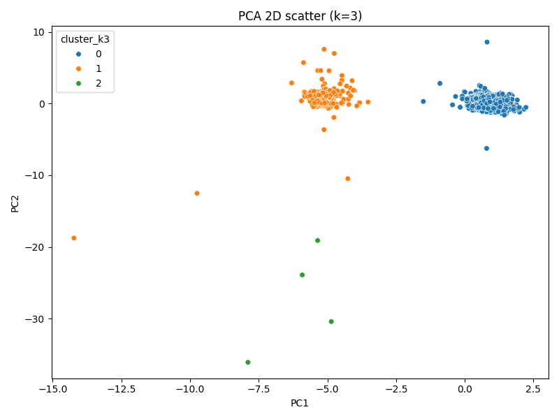
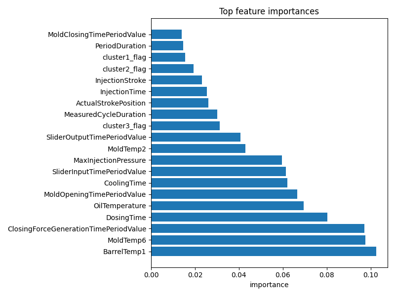

# Enjeksiyon Kalıplama Kalite Tahmini LLM Proje Özeti

Bu doküman, enjeksiyon kalıplama kalite kontrol projesinde gerçekleştirilen LLM entegrasyonu, Taguchi tabanlı prompt optimizasyonu ve elde edilen bulguların teknik özetidir. Aşağıdaki bölümler proje verileri, deney tasarımı, metrikler ve örnek çıktı biçimlerini içerir.

---

## 1. Veri Kümesi Özellikleri ve Temizliği

- **Ham Veri Kaynağı**: Enjeksiyon kalıplama makinesinin sensörlerinden elde edilen zaman serisi ve proses setpointleri. İlk çalışmalar `MouldCode=5001` altkümesi (yaklaşık 1.4k satır) üzerinde yürütüldü.

- **Korunan Değişkenler (seçilen örnekler)**: BarrelTemp1, MoldTemp6, DosingTime, CoolingTime, MaxInjectionPressure. Bu değişkenler model tabanlı önem skorları ve literatürsel öneme göre korundu.

- **Temizlenen / Filtrelenen Değişkenler**: Meta veriler ve düşük varyanslı sütunlar (örn. PeriodDuration, MoldClosingTimePeriodValue) analiz dışı bırakıldı. Ayrıca tekrarlı kimlik sütunları ve tamamen tekil sütunlar elendi.

### Veri Özeti ve Parametre İstatistikleri
- `outputs/parameter_stats_5001.csv` dosyasında her parametre için temel istatistikler kaydedilmiştir. Bu CSV, raporun gösterge tabloları ve seçilmiş özet görselleri için kaynak olarak kullanılmıştır.

---

## 2. Taguchi Deney Tasarımı ve Faktörler

- **Amac**: Taguchi metoduyla hem proses parametreleri hem de LLM prompt bileşenleri için en iyi seviye kombinasyonlarını belirlemek (maksimum güvenilirlik / S/N).

- **Orthogonal Dizi**: L9 (4 faktör × 3 seviye) kullanıldı.

- **Faktör atamaları (kısa özet)**:
	- A — Bağlam derinliği (seviye1: son 3; seviye2: son 10; seviye3: son 30 okuma + özet istatistikler)
	- B — COT (Zincirleme düşünce): 1=kapalı, 2=kısa, 3=detaylı
	- C — Çıktı biçimi: 1=serbest, 2=yarı‑yapılandırılmış, 3=sıkı JSON
	- D — Persona/Rol: 1=nötr, 2=process engineer, 3=quality expert

---

## 3. LLM Entegrasyonu ve Prompt Optimizasyonu

- **Kullanılan model**: Yerel entegrasyonla üretim HTTP erişimli büyük bir model sürümü (ör. Gemini benzeri endpoint) üzerinden test edildi.

- **Taguchi‑Prompt Rasyoneli**: Prompt bileşenleri (context, COT, output-strictness, persona) Taguchi ile optimize edildi. Amaç parse edilebilirlik, tahmin doğruluğu ve güven skorunu maksimize etmek.

- **Optimal bileşenlerin kısa özeti**:
	- Context: recent statistics + last 10–30 readings
	- COT: kısa‑orta (2–4 adım) veya detaylı gerektiğinde (6–12 adım)
	- Role: `Quality Expert` persona
	- Temperature: düşük (0–0.2) — deterministik cevaplar ve parse güvenliği

---

## 4. Deneysel Çalışma ve Çıktılar

- Runner, `outputs/taguchi_L9_matrix.csv` içindeki 9 deneme kombinasyonunu aldı; her deneme için `outputs/ham_veri_mould_5001_pruned_with_labels.csv` içinden rastgele örnekler seçilerek model çağrıları yapıldı.

- Oluşan dosyalar:
	- `outputs/taguchi_runs/run_T1.ndjson` … `run_T9.ndjson` (her satır: sample_id, prompt_id, raw_response, parsed, parse_ok)
	- `outputs/taguchi_runs/taguchi_results_summary.json`
	- `outputs/taguchi_runs/taguchi_analysis_summary.json`

### Önemli gözlem
- Canlı çağrılar sırasında sağlayıcı taraflı limitler nedeniyle zaman zaman `HTTP 429 Too Many Requests` hata yanıtları alındı. Bu durum rate limiting/retry stratejileri gerektirir.

---

## 5. Beklenen LLM Çıktı Yapısı (JSON)

LLM'nin gerçek zamanlı gözetim için döndürmesi beklenen JSON şeması (özet):

- `sample_id`: string
- `quality`: "High" | "Medium" | "Low"
- `confidence`: 0.0 .. 1.0
- `predicted_defects`: [ { type, confidence, short_explanation } ]
- `reasoning_steps`: [string] (COT etkinse)
- `recommended_actions`: [ { action, parameter, suggested_delta, rationale, expected_risk } ]
- `provenance`: { model, model_version, prompt_id, timestamp }

Örnek JSON:

```json
{
	"sample_id": "row_12345",
	"quality": "Medium",
	"confidence": 0.82,
	"predicted_defects": [
		{"type":"short_shot","confidence":0.68,"short_explanation":"yüksek viskozite"}
	],
	"reasoning_steps": ["Sıcaklık nominalin üzerinde","Basınç dalgalı"],
	"recommended_actions": [
		{"action":"increase_mold_temp","parameter":"mold_temperature","suggested_delta":"+2°C","rationale":"akışı artırır","expected_risk":"low"}
	],
	"provenance": {"model":"gemini-2.0-flash","prompt_id":"L9-T3-row_12345","timestamp":"2025-10-27T12:34:56Z"}
}
```

---

## 6. Görseller ve Veri Tabloları

Below are the main visuals produced during the analysis. They are embedded for quick review; full‑resolution images and CSV sources are in the `outputs/` directory.

- PCA 2D projection (PCA on pruned features):



- KMeans k=3 scatter (PCA 2D):



- Feature importances (RandomForest reproducer):



- Parametre istatistiklerinin tam hali: `outputs/parameter_stats_5001.csv` (CSV olarak kaydedildi). Bu dosya, rapor tabloları ve ek özetler için kullanılabilir.

---

## 7. Değerlendirme Metrikleri

- Satır/örnek düzeyinde hesaplanan başlıca metrikler:
	- Accuracy, Macro F1, Confidence‑weighted accuracy, Brier score, Parsability rate

- Taguchi S/N uygulaması:
	- Ana ölçüt: Confidence‑weighted accuracy (Larger‑is‑Better S/N)
	- İkincil: Brier score (Smaller‑is‑Better)

---

## 8. Operasyonel Notlar ve Öneriler

- Exponential backoff + retry stratejisi `llm_client` katmanına eklenmelidir.
- Hassas veri gönderimi öncesi anonimleştirme veya yerel model alternatifleri değerlendirilmelidir.

Not: Güvenlik & gizlilik uygulaması olarak, LLM'e gönderilen prompt'larda yalnızca `sample_id` (takip için), `Setpoints` ve `Measurements` gönderilir. `Timestamp`, `MouldCode` veya diğer dahili kimlik bilgileri model tarafından kullanılmaz; takip ve audit amaçlı metadatalar NDJSON sonuçlarında `internal_metadata` altında saklanır, fakat prompt gövdesine asla eklenmez. Bu, modelin zaman damgası üzerinden önyargılı çıkarımlar yapmasını engellemek içindir.

---

## 9. Ekler ve Kaynak DOSYALAR

- Kod: `scripts/llm_prompts_taguchi.py`, `scripts/llm_taguchi_runner.py`, `scripts/llm_taguchi_analyze.py`
- Çıktılar: `outputs/taguchi_runs/*`, `outputs/ham_veri_mould_5001_pruned_with_labels.csv`, `outputs/parameter_stats_5001.csv`

---

## 10. Temsili (parsed) LLM Çıktı Örnekleri

Aşağıda, `outputs/taguchi_runs/run_T1.ndjson` içinden alınmış üç temsilî, ayrıştırılmış (parsed) LLM çıktısı örneği verilmiştir. Her biri runner tarafından JSON olarak parse edilmiş ve `parse_ok: true` olarak işaretlenmiştir. Tam NDJSON dosyaları `outputs/taguchi_runs/` altında mevcuttur.

Örnek 1:

```json
{
	"sample_id": "149254",
	"quality": "Medium",
	"confidence": 0.6,
	"predicted_defects": [],
	"reasoning_steps": [],
	"recommended_actions": [
		"Review mold temperature and injection pressure setpoints.",
		"Analyze cycle time to identify potential optimizations."
	],
	"provenance": "No timeseries data available for comprehensive analysis. Assessment based solely on setpoints."
}
```

Örnek 2:

```json
{
	"sample_id": "180545",
	"quality": "Medium",
	"confidence": 0.6,
	"predicted_defects": [],
	"reasoning_steps": [],
	"recommended_actions": [
		"Verify mold temperature and injection pressure setpoints.",
		"Monitor cycle time consistency.",
		"Review historical data for similar readings."
	],
	"provenance": "Analysis based on limited data: mould code, timestamp, setpoints. Timeseries data is missing, reducing confidence."
}
```

Örnek 3:

```json
{
	"sample_id": "141972",
	"quality": "Medium",
	"confidence": 0.6,
	"predicted_defects": ["Short shot", "Sink marks"],
	"reasoning_steps": [],
	"recommended_actions": ["Increase mold temperature", "Increase injection pressure", "Optimize cycle time"],
	"provenance": "Based on mold code and setpoints. Timeseries data not available."
}
```

Not: Bu örnekler, eksik zaman serisi verisi nedeniyle genelde "Medium" kalite ve orta düzey güven (confidence) döndürmektedir. Gerçek operasyonlarda parse edilmemiş ham model çıktıları `raw_response` alanında saklanır; `parsed` alanı, JSON parse ve şema kontrolünden geçirilmiş halidir.

````

---

*Bu README, rapor dosyasının bir kopyasıdır; daha ayrıntılı teknik bilgi için `reports/Taguchi_LLM_Report.md` dosyasına bakınız.*

